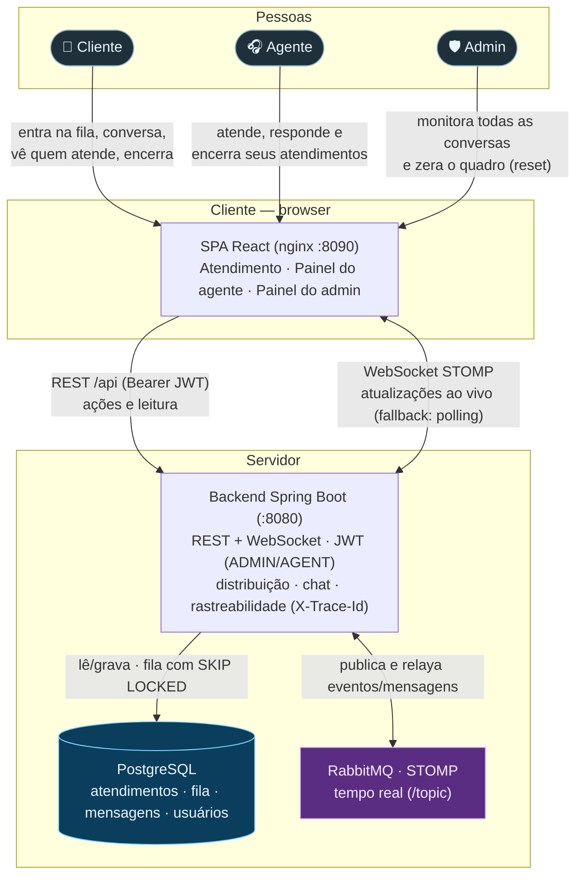

# Diagramas — routing-monitoring

Diagramas **as code** em [Mermaid](https://mermaid.js.org). Para visualizar/editar online:

- Cole o bloco em **https://mermaid.live** (exporta PNG/SVG).
- Ou abra este arquivo no **GitHub/GitLab** ou no **VS Code** (extensão *Markdown Preview Mermaid*) — ambos renderizam Mermaid nativamente.

> Alternativa: os mesmos diagramas podem ser transcritos para PlantUML (https://www.plantuml.com/plantuml) se preferir; aqui usamos Mermaid por renderizar direto no repositório.

---

## 1. Diagrama arquitetural

Visão de componentes: SPA no browser, backend Spring Boot (borda web → casos de uso → domínio → infraestrutura), Postgres e o broker STOMP (RabbitMQ) do tempo real.

```mermaid
flowchart LR
  %% ============ CLIENTE ============
  subgraph BROWSER["Browser — SPA React + Vite + Zustand · nginx (:8090)"]
    direction TB
    subgraph PAGES["Telas"]
      CUST["CustomerPage — /atendimento<br/>entra na fila · vê quem atende · chat · encerrar"]
      AGN["/painel · AgentConversations<br/>Meus atendimentos · encerrar · piscar nova msg"]
      ADM["/painel · AdminConversations<br/>monitor ao vivo · Encerrar tudo (reset)"]
    end
    subgraph FAPI["shared/api"]
      HTTP["http · public · chat · admin<br/>fetch + Bearer · 401/403 → logout"]
      RT["realtime.js — cliente STOMP"]
    end
    PAGES --> FAPI
  end

  %% ============ BACKEND ============
  subgraph BACKEND["Backend — Spring Boot 4.1 / Java 21 (:8080)"]
    direction TB
    subgraph EDGE["Borda web"]
      TRACE["TraceIdFilter<br/>X-Trace-Id ↔ MDC traceId"]
      JWT["Spring Security<br/>JWT resource server · roles ADMIN/AGENT"]
    end
    subgraph WEB["Controllers (REST + WS)"]
      AUTHC["AuthController"]
      PUBC["PublicInteractionController"]
      INTC["InteractionController"]
      AGNC["AgentChatController"]
      ADMC["AdminController"]
      TEAMC["TeamController"]
      DASHC["DashboardController"]
      WSC["WebSocketConfig · /ws (STOMP)"]
    end
    subgraph APP["Casos de uso (application)"]
      CREATE["CreateInteraction"]
      END["EndInteraction"]
      ADV["AdvanceQueue"]
    end
    subgraph DOMAIN["Domínio (Java puro, sem Spring/JPA)"]
      DIST["DistributionService<br/>SubjectRouter · RoutingStrategy"]
      MODEL["Interaction · Agent · Team<br/>DomainEvents (sealed)"]
    end
    subgraph INFRA["Infraestrutura"]
      REPO["Adapters JPA<br/>Interaction · Agent · Team · Queue · Message"]
      CHAT["ChatService"]
      NOTIF["DashboardNotifier<br/>@TransactionalEventListener (após commit)"]
      PUB["SpringEventPublisher"]
    end

    EDGE --> WEB
    WEB --> APP
    AGNC --> CHAT
    PUBC --> CHAT
    ADMC --> REPO
    DASHC --> REPO
    APP --> DOMAIN
    APP --> REPO
    DOMAIN -. publica evento .-> PUB --> NOTIF
  end

  %% ============ DADOS + TEMPO REAL ============
  subgraph DATA["Persistência & tempo real"]
    PG[("PostgreSQL (:5432)<br/>team · agent · interaction<br/>interaction_queue · message · app_user")]
    MQ["RabbitMQ — STOMP broker (:61613)<br/>relay de /topic · escala horizontal<br/>(modo simple = broker em memória)"]
  end

  %% ============ LIGAÇÕES CLIENTE ↔ SERVIDOR ============
  HTTP -->|"REST /api/** · Authorization: Bearer"| EDGE
  RT -->|"WebSocket STOMP · connect /ws<br/>SUB /topic/dashboard e /topic/chat.{id}"| WSC
  WSC -->|"push de frames STOMP"| RT

  REPO --> PG
  CHAT -->|"convertAndSend /topic/chat.{id}"| MQ
  NOTIF -->|"convertAndSend /topic/dashboard"| MQ
  WSC <-->|"relay STOMP (/topic)"| MQ

  classDef store fill:#0b3d5c,stroke:#7fd3ff,color:#eaf6ff;
  classDef broker fill:#5a2d82,stroke:#d3a6ff,color:#f6ecff;
  class PG store;
  class MQ broker;
```

**Como ler:** o browser fala com o backend por dois canais — **REST** (`/api/**`, com `Bearer` e passando pelo `TraceIdFilter` + JWT) e **WebSocket STOMP** (`/ws`). Escrever é sempre REST; o **push** (eventos do dashboard e mensagens de chat) sai do domínio como evento, vira mensagem STOMP **após o commit**, e o broker faz o *fan-out* para todos os assinantes de `/topic/*`. A fila de espera é uma **tabela no Postgres** (não o broker), consumida com `SELECT … FOR UPDATE SKIP LOCKED`.

---

## 2. Diagrama de comunicação — alto nível (contexto & containers)

Visão de "caixas grandes": quem usa o sistema, os dois containers (SPA no browser e backend), os dois canais de comunicação (REST e WebSocket) e onde os dados vivem. Sem passo a passo — só **quem fala com quem e para quê**.

**Como ler:** as três pessoas usam **uma mesma SPA** (telas diferentes conforme o papel). A SPA conversa com **um** backend por dois canais: **REST** para agir/ler (com token JWT) e **WebSocket (STOMP)** para receber tudo ao vivo — se o WebSocket não estiver disponível, cai para *polling*. No servidor, o backend guarda o estado no **Postgres** (inclusive a fila de espera, drenada com `SKIP LOCKED`) e usa o **RabbitMQ** só como transporte de tempo real (o que permite escalar o backend horizontalmente). Um diagrama mais detalhado por componentes está na seção 1.
